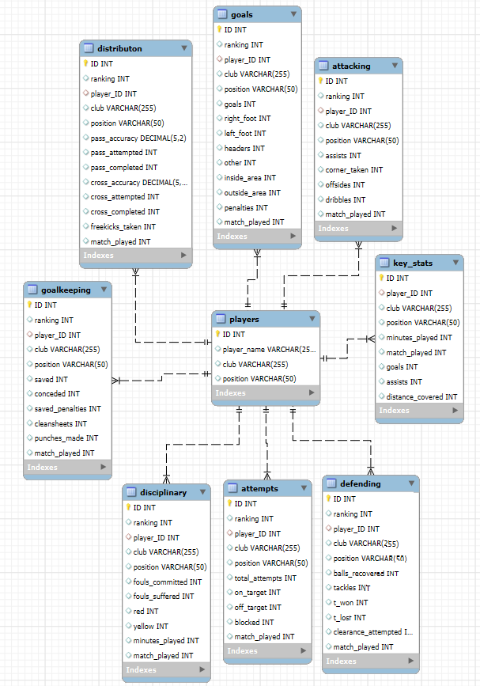

# Data-Engineering-1-Term-project-1-documentation

## Introduction
For my Term Project 1 assignment, I worked with the UEFA Champions League database, which provides a collection of data tables detailing player statistics from the 2021-22 UCL season.

### Analytical Questions
During this project, I aimed to gain insights into the dataset from three different perspectives. I chose to answer the following questions:

1. What are the differences between the positions? Which positions have better rankings from a statistical perspective?
2. What are the differences between the teams? Which team is more aggressive, and is this strategy more effective or not?
3. Who was the most effective attacking player in the UCL 2021-22 season?

## Data

### Source
I downloaded the raw database from [Kaggle](https://www.kaggle.com/datasets/azminetoushikwasi/ucl-202122-uefa-champions-league).

The downloaded CSV files are stored in a compressed folder: `ucl_database.zip`. This folder contains the following 7 CSV files:

- `attacking.csv`
- `attempts.csv`
- `defending.csv`
- `disciplinary.csv`
- `distribution.csv`
- `goalkeeping.csv`
- `goals.csv`
- `key_stats.csv`

In every table I added a player_ID column what I will use later in my project. 

Here you can find a description about each table:
### 1. `attacking` Table
This table contains data about attacking statistics for players.

- **ID**: Unique identifier for each record (auto-incremented).
- **ranking**: Overall player ranking based on their attacking performance.
- **player_name**: Name of the player.
- **player_ID**: Unique identifier for the player.
- **club**: The club for which the player plays.
- **position**: The playing position of the player (e.g., forward, midfielder).
- **assists**: Number of assists made by the player.
- **corner_taken**: Number of corners taken by the player.
- **offsides**: Number of times the player was caught offside.
- **dribbles**: Number of successful dribbles made by the player.
- **match_played**: Number of matches the player participated in.

### 2. `attempts` Table
This table holds data on shooting and goal attempts.

- **ID**: Unique identifier for each record (auto-incremented).
- **ranking**: Overall player ranking based on shooting statistics.
- **player_name**: Name of the player.
- **player_ID**: Unique identifier for the player.
- **club**: The club for which the player plays.
- **position**: The playing position of the player.
- **total_attempts**: Total number of shot attempts made by the player.
- **on_target**: Number of attempts that were on target.
- **off_target**: Number of attempts that were off target.
- **blocked**: Number of shot attempts that were blocked.
- **match_played**: Number of matches the player participated in.

### 3. `defending` Table
This table provides information on defensive statistics for players.

- **ID**: Unique identifier for each record (auto-incremented).
- **ranking**: Overall player ranking based on defensive statistics.
- **player_name**: Name of the player.
- **player_ID**: Unique identifier for the player.
- **club**: The club for which the player plays.
- **position**: The playing position of the player.
- **balls_recovered**: Number of times the player recovered possession.
- **tackles**: Number of tackles made by the player.
- **t_won**: Number of tackles won.
- **t_lost**: Number of tackles lost.
- **clearance_attempted**: Number of clearances attempted by the player.
- **match_played**: Number of matches the player participated in.

### 4. `disciplinary` Table
This table tracks disciplinary records for players.

- **ID**: Unique identifier for each record (auto-incremented).
- **ranking**: Overall player ranking based on disciplinary records.
- **player_name**: Name of the player.
- **player_ID**: Unique identifier for the player.
- **club**: The club for which the player plays.
- **position**: The playing position of the player.
- **fouls_committed**: Number of fouls committed by the player.
- **fouls_suffered**: Number of fouls the player suffered.
- **red**: Number of red cards received by the player.
- **yellow**: Number of yellow cards received by the player.
- **minutes_played**: Total minutes the player played.
- **match_played**: Number of matches the player participated in.

### 5. `distributon` Table
This table holds data on passing and distribution statistics.

- **ID**: Unique identifier for each record (auto-incremented).
- **ranking**: Overall player ranking based on passing accuracy and attempts.
- **player_name**: Name of the player.
- **player_ID**: Unique identifier for the player.
- **club**: The club for which the player plays.
- **position**: The playing position of the player.
- **pass_accuracy**: Pass accuracy as a percentage.
- **pass_attempted**: Number of passes attempted by the player.
- **pass_completed**: Number of completed passes by the player.
- **cross_accuracy**: Cross accuracy as a percentage.
- **cross_attempted**: Number of crosses attempted.
- **cross_completed**: Number of crosses completed.
- **freekicks_taken**: Number of free kicks taken.
- **match_played**: Number of matches the player participated in.

### 6. `goalkeeping` Table
This table provides goalkeeping statistics for players.

- **ID**: Unique identifier for each record (auto-incremented).
- **ranking**: Overall player ranking based on goalkeeping performance.
- **player_name**: Name of the player.
- **player_ID**: Unique identifier for the player.
- **club**: The club for which the player plays.
- **position**: The playing position of the player (goalkeeper).
- **saved**: Number of saves made by the goalkeeper.
- **conceded**: Number of goals conceded by the goalkeeper.
- **saved_penalties**: Number of penalties saved.
- **cleansheets**: Number of matches without conceding a goal.
- **punches_made**: Number of punches made to clear the ball.
- **match_played**: Number of matches the player participated in.

### 7. `goals` Table
This table captures detailed information about the types of goals scored.

- **ID**: Unique identifier for each record (auto-incremented).
- **ranking**: Overall player ranking based on goal statistics.
- **player_name**: Name of the player.
- **player_ID**: Unique identifier for the player.
- **club**: The club for which the player plays.
- **position**: The playing position of the player.
- **goals**: Total number of goals scored by the player.
- **right_foot**: Number of goals scored with the right foot.
- **left_foot**: Number of goals scored with the left foot.
- **headers**: Number of goals scored with headers.
- **other**: Number of goals scored by other means.
- **inside_area**: Number of goals scored inside the penalty area.
- **outside_area**: Number of goals scored from outside the penalty area.
- **penalties**: Number of goals scored from penalty kicks.
- **match_played**: Number of matches the player participated in.

### 8. `key_stats` Table
This table provides general key statistics for players.

- **ID**: Unique identifier for each record (auto-incremented).
- **player_name**: Name of the player.
- **player_ID**: Unique identifier for the player.
- **club**: The club for which the player plays.
- **position**: The playing position of the player.
- **minutes_played**: Total minutes the player played.
- **match_played**: Number of matches the player participated in.
- **goals**: Total number of goals scored by the player.
- **assists**: Number of assists made by the player.
- **distance_covered**: Total distance covered by the player during matches (in meters).

## Operational layer

To create my relational database out of these csv files I created a new table which contains basic information of the players with the following columns:

### 9. `players` Table

- **ID**: Unique identifier for each record (auto-incremented).
- **player_name**: Name of the player.
- **club**: The club for which the player plays.
- **position**: The playing position of the player (e.g., forward, midfielder, defender, goalkeeper).

After that I updated every table with the player_ID's and removed the player_name columns.

> **Note:** It would als make sense to remove the positon and club column too because they can be found in the player table, altough I chose not to do that in my project.

After these changes I could creat my relational database which has the following EER diagram:


### Reproducing the Database

To reproduce this database for yourself, you have two options:

1. **Using the `ucl_database_dump.sql` File**  
   The `ucl_database_dump.sql` file will automatically create the tables and populate them with the content from the CSV files. Afterward, it will create the players table and establish the necessary joins to achieve the desired database structure.

2. **Creating the Database from Scratch**  
   If you prefer to create the database from the beginning, use the `ucl_database_creation.sql` file. However, in this case, you will need to place the CSV files in the secure folder. You can find the path to this folder with the following command:

   ```sql
   SHOW VARIABLES LIKE 'secure_file_priv';

Once you have located your secure folder, create a subfolder named database and insert the downloaded CSV files into it. After that, running the ucl_database_creation.sql file should work perfectly.

## Data Warehouse

For the next steps of the project, we will use the `ucl_ETL_pipeline.sql` file.

From the relational database, I created a data warehouse for further analytics. The warehouse has the following attributes:
| Variable                     | Description                                                                 |
|------------------------------|-----------------------------------------------------------------------------|
| `player_ID`                  | Unique identifier for each player.                                         |
| `player_name`                | Name of the player.                                                        |
| `club`                       | The club the player is affiliated with.                                     |
| `position`                   | The playing position of the player (e.g., Forward, Midfielder, Defender).  |
| `assists`                    | Number of assists made by the player.                                      |
| `corner_taken`               | Number of corners taken by the player.                                     |
| `offsides`                   | Number of times the player was caught offside.                            |
| `dribbles`                   | Number of successful dribbles by the player.                              |
| `match_played`               | Total matches played by the player.                                        |
| `minutes_played`             | Total minutes played by the player.                                        |
| `total_attempts`             | Total attempts on goal made by the player.                                 |
| `on_target`                  | Number of attempts on target.                                              |
| `off_target`                 | Number of attempts off target.                                             |
| `blocked`                    | Number of shots blocked by defenders.                                      |
| `balls_recovered`            | Number of balls recovered by the player.                                   |
| `tackles`                    | Total tackles made by the player.                                         |
| `tackles_won`                | Number of successful tackles.                                              |
| `tackles_lost`               | Number of unsuccessful tackles.                                            |
| `clearance_attempted`        | Number of defensive clearances attempted by the player.                    |
| `fouls_committed`            | Total fouls committed by the player.                                       |
| `fouls_suffered`             | Total fouls suffered by the player.                                        |
| `red_card`                   | Number of red cards received by the player.                                |
| `yellow_card`                | Number of yellow cards received by the player.                             |
| `pass_accuracy`              | Accuracy of passes made by the player (percentage).                        |
| `pass_attempted`             | Total number of passes attempted by the player.                            |
| `pass_completed`             | Total number of passes completed by the player.                            |
| `freekicks_taken`            | Number of free kicks taken by the player.                                  |
| `goals`                      | Total number of goals scored by the player.                                |
| `penalties`                  | Number of penalties scored by the player.                                  |
| `right_foot_goals`          | Goals scored using the right foot.                                        |
| `left_foot_goals`           | Goals scored using the left foot.                                         |
| `header_goals`              | Goals scored with the head.                                               |
| `saved_balls`                | Number of balls saved by the goalkeeper.                                   |
| `conceded_goals`            | Number of goals conceded by the goalkeeper.                                |
| `saved_penalties`            | Number of penalties saved by the goalkeeper.                               |
| `cleansheets`                | Number of clean sheets kept by the goalkeeper.                             |
| `punches_made`               | Number of punches made by the goalkeeper.                                  |
| `distance_covered`           | Total distance covered by the player during matches.                       |
| `total_ranking`              | Sum of the rankings from various statistics.                               |
| `number_of_rankings`         | Total number of rankings included in the total ranking.                   |
